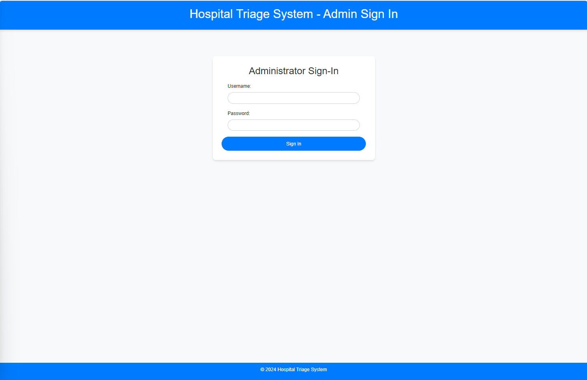

# Hospital Triage System
## Assignment 4 - Group 20:

Quang Minh Le - 300165003

David Nguyen - 300232884

## Table of Contents
1. [Introduction](#introduction)
2. [Prerequisites](#prerequisites)
3. [Setup Instructions](#setup-instructions)
    - [Download and Install XAMPP](#download-and-install-xampp)
    - [Set Up phpMyAdmin](#set-up-phpmyadmin)
    - [Create the Database](#create-the-database)
    - [Clone the Project](#clone-the-project)
4. [Walkthrough of the UI](#walkthrough-of-the-ui)
    - [Patient Registration](#patient-registration)
    - [Patient Sign-In](#patient-sign-in)
    - [Patient Homepage](#patient-homepage)
    - [Admin Sign-In](#admin-sign-in)
    - [Admin Dashboard](#admin-dashboard)
5. [Contributing](#contributing)
6. [License](#license)

## Introduction
The Hospital Triage System is a web application designed to manage patient registrations, sign-ins, and the triage process based on the severity of their conditions. Admins can oversee patient information and update their status from "pending" to "ready."

## Prerequisites
Before you begin, ensure you have the following installed on your local machine:
- [XAMPP](https://www.apachefriends.org/index.html)

## Setup Instructions

### Download and Install XAMPP
1. Download XAMPP from [Apache Friends](https://www.apachefriends.org/index.html).
2. Install XAMPP by following the on-screen instructions.
3. Once installed, open the XAMPP Control Panel and start the Apache and MySQL services.

### Set Up phpMyAdmin
1. Open your browser and go to `http://localhost/phpmyadmin`.
2. In phpMyAdmin, click on the "Databases" tab.

### Create the Database
1. In the "Create database" field, enter `hospital_triage_system` and click "Create".
2. Go to the "SQL" tab and run the following SQL commands to create the `users` table:
    ```sql
    CREATE TABLE `users` (
        `id` int(11) NOT NULL AUTO_INCREMENT,
        `full_name` varchar(255) NOT NULL,
        `email` varchar(255) NOT NULL,
        `password` varchar(255) NOT NULL,
        `severity` int(11) NOT NULL,
        `status` varchar(20) NOT NULL DEFAULT 'pending',
        PRIMARY KEY (`id`)
    );
    ```

### Clone the Project
1. Download or clone the project repository to your local machine.
2. Move the project folder to the `htdocs` directory of your XAMPP installation. This is typically located at `C:\xampp\htdocs` on Windows or `/Applications/XAMPP/htdocs` on macOS.

### Configure the Database Connection
1. Open the `database.php` file in your project directory.
2. Update the database connection details as follows:
    ```php
    <?php
    $servername = "localhost";
    $username = "root";
    $password = "";
    $dbname = "hospital_triage_system";

    // Create connection
    $conn = new mysqli($servername, $username, $password, $dbname);

    // Check connection
    if ($conn->connect_error) {
        die("Connection failed: " . $conn->connect_error);
    }
    ?>
    ```

## Walkthrough of the UI

### Welcome Page
1. **Section Name:** Welcome
2. **Description:** Choose sign-in option (patient or admin)
4. **Actions:** patient login / admin login


### Patient Registration
1. **Section Name:** Registration Form
2. **Description:** Allows patients to register by providing their full name, email, password, and severity of their condition.
3. **Fields:** Full Name, Email, Password, Severity (dropdown)
4. **Actions:** Register Button


### Patient Sign-In
1. **Section Name:** Sign-In Form
2. **Description:** Allows registered patients to sign in using their email and password.
3. **Fields:** Email, Password
4. **Actions:** Sign In Button


### Patient Homepage
1. **Section Name:** Patient Dashboard
2. **Description:** Displays a welcome message and provides a logout option.
3. **Actions:** Logout Button


### Admin Sign-In
1. **Section Name:** Admin Sign-In Form
2. **Description:** Allows the admin to sign in using a hardcoded username and password.
3. **Fields:** Username (admin), Password (admin)
4. **Actions:** Sign In Button



### Admin Dashboard
1. **Section Name:** Admin Dashboard
2. **Description:** Displays two tables:
   - **Pending Patients:** Lists all patients with a status of "pending" and includes a button to mark them as "ready".
   - **Ready Patients:** Lists all patients with a status of "ready".
3. **Actions:** Mark as Ready Button (for pending patients), Logout Button


## License
This project is licensed under the MIT License. See the LICENSE file for details.
